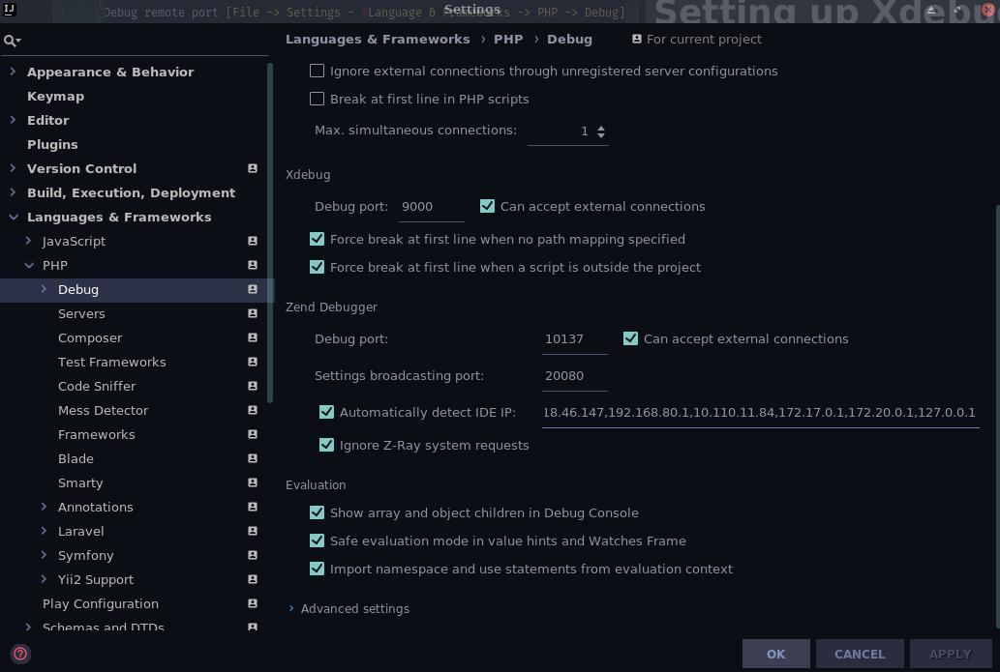
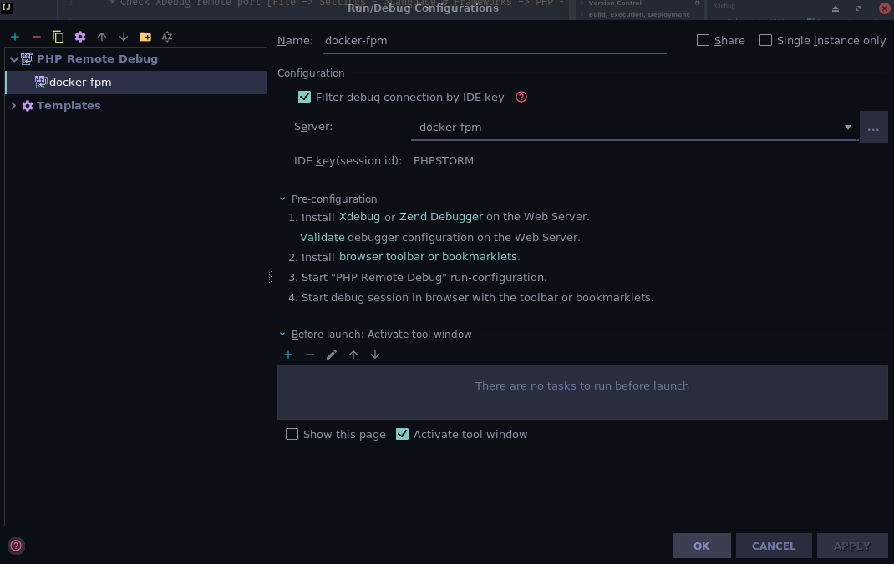
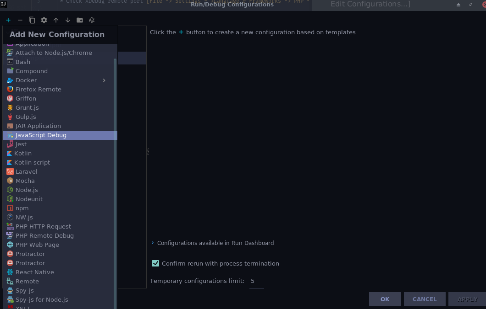
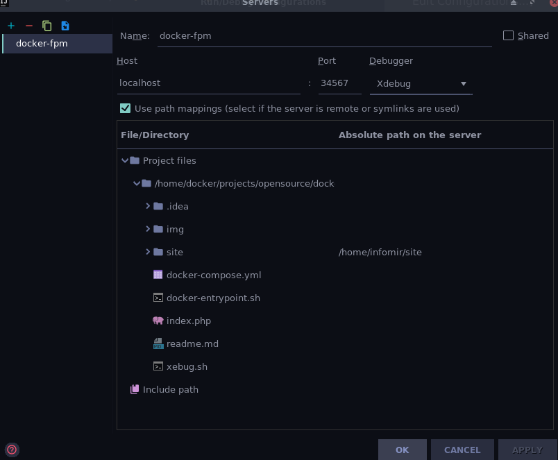
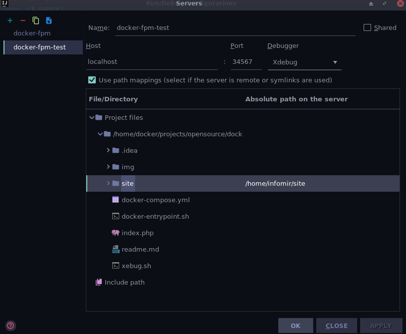
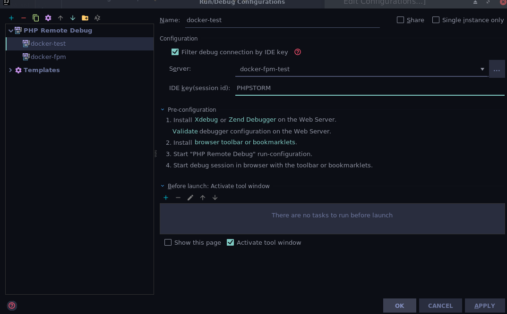
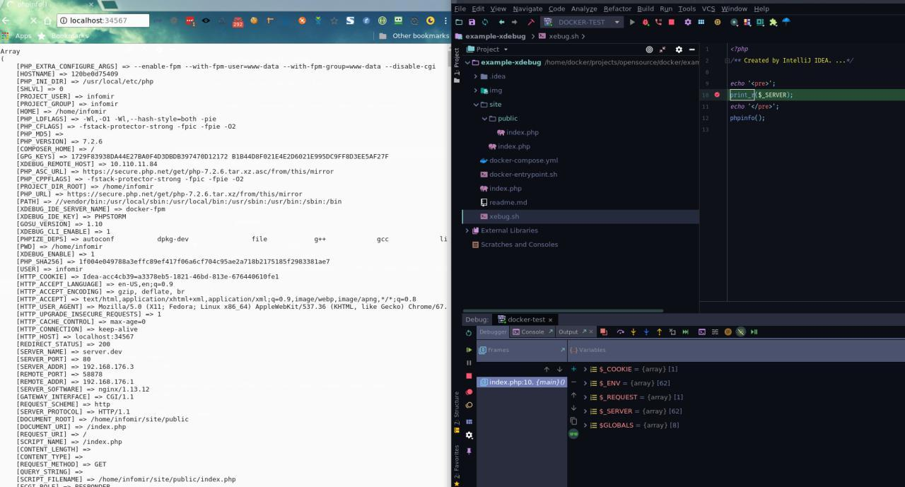

# Setting up Xdebug for cli. PhpStorm & Intellij IDEA

* Check XDebug remote port [File -> Settings - >Language & Frameworks -> PHP -> Debug]

If you change port number, change it in settings

* Configure remote XDebug server. Open configurations [ Run -> Edit Configurations...]

* Press '+' for add new configuration

* Enable "Filter debug connection by IDE Key"

* Use PHP Remote Debug for new configuration

* Add server configuration. Press "..." for 'Server'
* Enter name
* Host: localhost
* Port: 80
* Use path mapping for directory in container: Your local directory add to mapping with container directory structure

* Apply changes
* Add IDE key: PHPSTORM or your IDE key

# Setting up Xdebug for web. PhpStorm & Intellij IDEA

See Setting up for cli.

Result:

## Links

[See off documentation for more details](https://www.jetbrains.com/help/phpstorm/configuring-xdebug.html)
[See off documentation for more details for docker](https://confluence.jetbrains.com/display/PhpStorm/Docker+Support+in+PhpStorm#DockerSupportinPhpStorm-DebuggingthePHPwebapplicationrunningintheDockercontainer)
